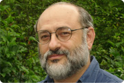
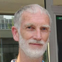
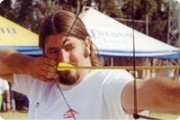

If you have any questions or comments about Esmeralda - Laue Suite, please contact [Juan Rodriguez-Carvajal](mailto:rodriguez-carvajal@ill.fr).

## Current Esmeralda team

The Esmeralda Laue Suite has been mainly developed by Luis and Juan at ILL. It is based in the library [CrysFML](https://code.ill.fr/scientific-software/crysfml).

{: class="float-right rounded"} 
#### **Juan Rodriguez-Carvajal**, Institut Laue-Langevin (ILL)

Lorem ipsum dolor sit amet, consectetur adipiscing elit. Aliquam interdum sapien vitae leo auctor, vitae vulputate ligula tempor. Vivamus eget posuere quam. Nunc rutrum felis vel felis vehicula imperdiet. Vivamus eget lacinia est. Aenean bibendum nulla tincidunt dolor ornare, nec egestas eros dictum. Donec dolor mauris, tempor et dui eu, lacinia tempor eros. Maecenas vel tellus semper, gravida neque vel, pulvinar augue.

{: class="float-right rounded"} 
#### **Alain Filhol**, former Institut Laue-Langevin (ILL)

Lorem ipsum dolor sit amet, consectetur adipiscing elit. Aliquam interdum sapien vitae leo auctor, vitae vulputate ligula tempor. Vivamus eget posuere quam. Nunc rutrum felis vel felis vehicula imperdiet. Vivamus eget lacinia est. Aenean bibendum nulla tincidunt dolor ornare, nec egestas eros dictum. Donec dolor mauris, tempor et dui eu, lacinia tempor eros. Maecenas vel tellus semper, gravida neque vel, pulvinar augue.

## Former Esmeralda programmers

{: class="float-right rounded"} 
#### **Luis Fuentes-Montero**, Diamond Light Source

Lorem ipsum dolor sit amet, consectetur adipiscing elit. Aliquam interdum sapien vitae leo auctor, vitae vulputate ligula tempor. Vivamus eget posuere quam. Nunc rutrum felis vel felis vehicula imperdiet. Vivamus eget lacinia est. Aenean bibendum nulla tincidunt dolor ornare, nec egestas eros dictum. Donec dolor mauris, tempor et dui eu, lacinia tempor eros. Maecenas vel tellus semper, gravida neque vel, pulvinar augue.

{: class="float-right rounded"} 
#### **Petr Čermák**, Charles University (MGML.eu)

Petr is currently working as the instrument responsible at the Heinz Maier-Leibnitz Zentrum (MLZ) in Garching. He joined the Esmeralda team when the whole software was almost finished, did some optimalization and rewrite the rendering engine to OpenGL. He is also mainaining this website.

Contact: [cermak@mag.mff.cuni.cz](mailto:cermak@mag.mff.cuni.cz)

